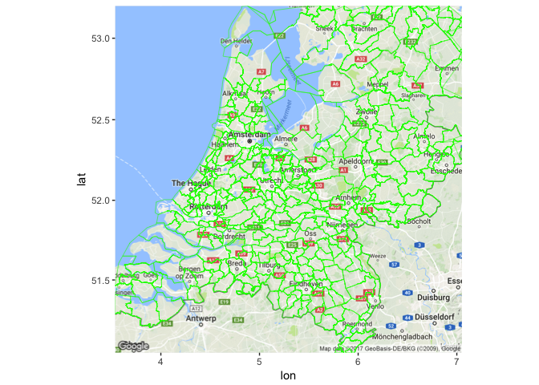
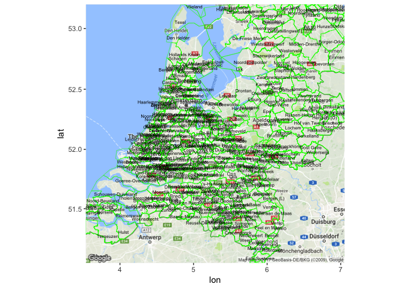

# Gemeentekaart Nederland in R
Witek ten Hove  
2/12/2017  

De data is online beschikbaar. O.a. [hier](https://data.overheid.nl/data/dataset/grenzen-van-alle-nederlandse-gemeenten-en-provincies/resource/d5570855-ceb7-458b-ba93-61e5ec332649). Plaats alle shapefiles in dezelfde folder als je R script en lees de data in.


```r
library(rgdal)
gemeentenShp <- readOGR(".","gemeenten")
```

```
## OGR data source with driver: ESRI Shapefile 
## Source: ".", layer: "gemeenten"
## with 393 features
## It has 6 fields
```

Converteer de coordinaten naar een voor R bruikbaar format.


```r
gemeentenShp <- spTransform(gemeentenShp, CRS("+proj=longlat +datum=WGS84"))
```

Zet de lijst om naar een data frame.


```r
library(broom)
gemeentenDF <- tidy(gemeentenShp)
```

Bouw de kaart.


```r
library(ggplot2)
library(ggmap)
nl<-get_map("Netherlands",zoom=8)
nl <- ggmap(nl) +
  geom_polygon(aes(x=long,
                   y=lat,
                   group=group),
               fill='grey',
               size=.2,
               color='green',
               data=gemeentenDF,
               alpha=0)
nl
```

<!-- -->

Voeg de namen van de gemeenten toe. Aan de data frame


```r
gemeentenMeta <- gemeentenShp@data
gemeentenMeta$ID <- row.names(gemeentenMeta)
gemeentenDF <- merge(gemeentenDF, gemeentenMeta, by.x = 'id', by.y = 'ID')
```

Maak een aparte data frame aan met de namen van de gemeenten en het middelpunt van de coordinaten. Voeg deze als text layer toe aan de kaart.


```r
cnames <- aggregate(cbind(long, lat) ~ GEMEENTENA, data=gemeentenDF, FUN=mean)

nl <- nl +
  geom_text(data=cnames, aes(long, lat, label = GEMEENTENA), size=2)
nl
```

<!-- -->

Source:

D. Kahle and H. Wickham. ggmap: Spatial Visualization with ggplot2. The R
  Journal, 5(1), 144-161. URL
  http://journal.r-project.org/archive/2013-1/kahle-wickham.pdf
