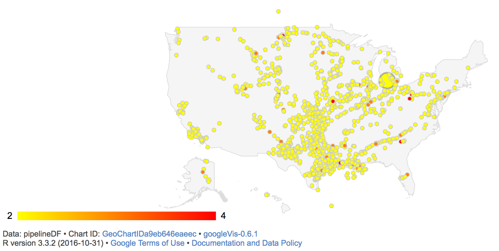

This is an example on reading data in from an online CSV file. The data source comes from [Kaggle](https://www.kaggle.com/). The data is prepared and visualised using Google visualization widgets.

First the online data file is read in.

```{r, echo=TRUE, message=FALSE, warning=FALSE}
pipelineDF <- read.csv("https://raw.githubusercontent.com/minorsmart/FEB2017/master/Witek/Pipelines/database.csv")
```

Using the `dplyr` package some columns holding geo data in proper format and level of fire (no fire, ignition, explosion) are added.

```{r, echo=TRUE, message=FALSE, warning=FALSE}
library(dplyr)
pipelineDF <- mutate(pipelineDF,
                     LatLong = paste0(Accident.Latitude,":", Accident.Longitude),
                     Fire = as.numeric(Liquid.Ignition) + as.numeric(Liquid.Explosion)
                     )
```
Finally the map is created and plotted.
 
```{r, echo=TRUE, message=FALSE, warning=FALSE, results='asis'}
library(googleVis)
pipelinesMap <- gvisGeoChart(pipelineDF, 'LatLong', 
                          sizevar='All.Costs',
                          colorvar='Fire',
                          options=list( region="US",
                                        width = 1000, heigth = 800,
                                        colorAxis="{colors:[\'yellow',\'red']}"
                                        )
                          )
plot(pipelinesMap)
```



