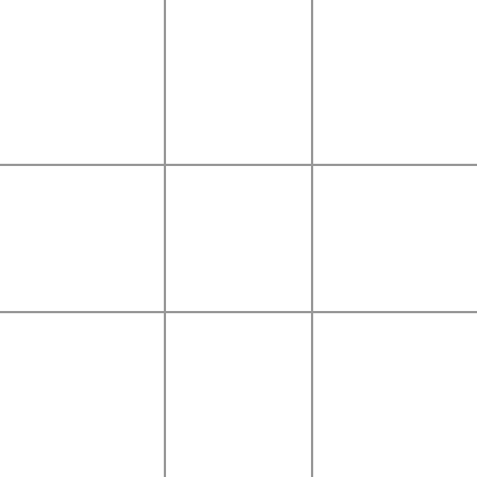

From: https://www.r-bloggers.com/tic-tac-toe-simulation-random-moves/

This first code snippet draws the Tic Tac Toe simulation board. The variable xo holds the identity of the pieces and the vector board holds the current game. Player X is denoted with -1 and player O with +1. The first part of the function draws the board and the naughts and crosses. The second part of the code check for three in a row and draws the corresponding line.

```{r}
draw.board <- function(board) { # Draw the board
    xo <- c("X", " ", "O") # Symbols
    par(mar = rep(0,4))
    plot.new()
    plot.window(xlim = c(0,30), ylim = c(0,30))
    abline(h = c(10, 20), col="darkgrey", lwd = 4)
    abline(v = c(10, 20), col="darkgrey", lwd = 4)
    pieces <- xo[board + 2]
    text(rep(c(5, 15, 25), 3), c(rep(25, 3), rep(15,3), rep(5, 3)), pieces, cex = 6)
    # Identify location of any three in a row
    square <- t(matrix(board, nrow = 3))
    hor <- abs(rowSums(square))
    if (any(hor == 3)) 
      hor <- (4 - which(hor == 3)) * 10 - 5 
    else
      hor <- 0
    ver <- abs(colSums(square))
    if (any(ver == 3)) 
      ver <- which(ver == 3) * 10 - 5 
    else
      ver <- 0
    diag1 <- sum(diag(square))
    diag2 <- sum(diag(t(apply(square, 2, rev)))) 
    # Draw winning lines 
    if (hor > 0) lines(c(0, 30), rep(hor, 2), lwd=10, col="red")
    if (ver > 0) lines(rep(ver, 2), c(0, 30), lwd=10, col="red")
    if (abs(diag1) == 3) lines(c(2, 28), c(28, 2), lwd=10, col="red")
    if (abs(diag2) == 3) lines(c(2, 28), c(2, 28), lwd=10, col="red")
}
```

The second part of the code generates ten random games and creates and animated GIF-file. The code adds random moves until one of the players wins (winner <> 0) or the board is full (no zeroes in the game vector). The eval.winner function checks for three in a row and declares a winner when found.

There are 255,168 possible legal games in Tic Tac Toe, 46,080 of which end in a draw. This implies that these randomised games result in a draw 18% of the time.

```{r}
eval.winner <- function(board) { # Identify winner
    square <- t(matrix(board, nrow = 3))
    hor <- rowSums(square)
    ver <- colSums(square)
    diag1 <- sum(diag(square))
    diag2 <- sum(diag(t(apply(square, 2, rev))))
    if (3 %in% c(hor, ver, diag1, diag2)) return (1)
    else
        if (-3 %in% c(hor, ver, diag1, diag2)) return (2)
    else
        return(0)
}
 
# Random game
library(animation)
saveGIF ({
 for (i in 1:10) {
 game <- rep(0, 9) # Empty board
 winner <- 0 # Define winner
 player <- -1 # First player
 draw.board(game)
 while (0 %in% game & winner == 0) { # Keep playing until win or full board
   empty <- which(game == 0) # Define empty squares
   move <- empty[sample(length(empty), 1)] # Random move
   game[move] <- player # Change board
   draw.board(game)
   winner <- eval.winner(game) # Evaulate game
   player <- player * -1 # Change player
 }
 draw.board(game)
 }
 },
 interval = 0.25, movie.name = "ttt.gif", ani.width = 600, ani.height = 600)
```

